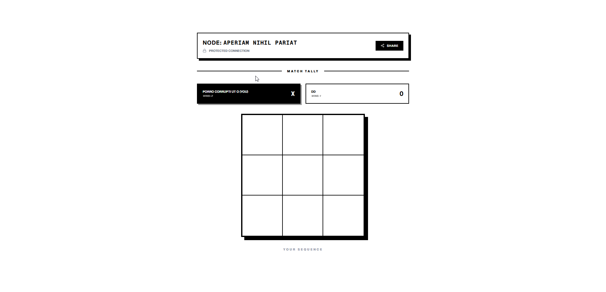
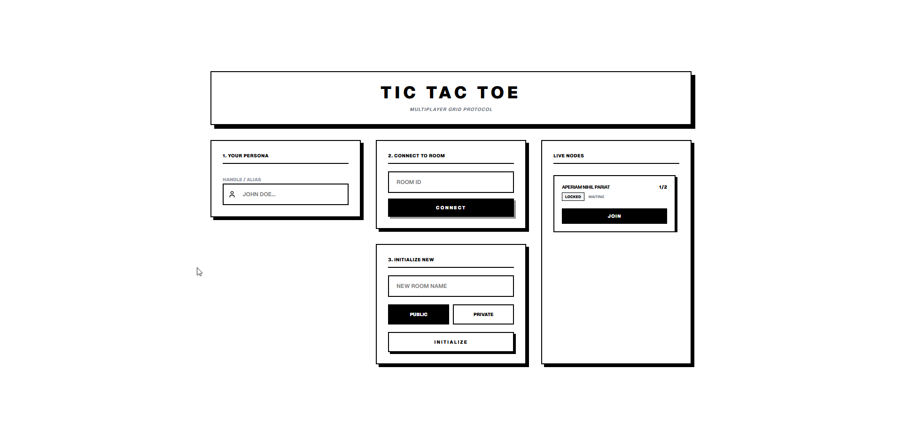

# Multiplayer Grid Protocol (Tic-Tac-Toe)

A minimalist, real-time multiplayer Tic-Tac-Toe application built with **Next.js**, **Socket.IO**, and **Bun**.


## 📸 Demo

<div align="center">
  
  
</div>

## 🌟 Overview

This project reimagines the classic Tic-Tac-Toe game as a "Multiplayer Grid Protocol" with a distinct, brutalist/minimalist aesthetic. It features real-time gameplay, room management with privacy controls, and a persistent scoreboard for match sessions.

### Key Features

-   **Real-Time Gameplay**: Seamless moves and updates using Socket.IO.
-   **Room Management**:
    -   Create public or private rooms.
    -   Secure private rooms with access passwords.
    -   "Live Nodes" dashboard to see active rooms.
-   **Minimalist UI**: A monochrome, data-centric design language.
-   **Session Tracking**: Persistent win counting and mutual re-link (rematch) functionality.
-   **Smart Join**: Direct specific room connection via ID or browsing the active node list.

## 🏗 Architecture

The project is structured as a mono-repo containing the client and server applications:

-   [`server/`](./server): A **Bun** + **Socket.IO** server handling game state, rooms, and real-time events.
-   [`web/`](./web): A **Next.js** (App Router) frontend delivering the user interface.

## 🚀 Getting Started

### Prerequisites

-   [Bun](https://bun.sh/) (v1.0.0 or later)

### Installation

1.  **Clone the repository**
    ```bash
    git clone https://github.com/lwshakib/tic-tac-toe-game.git
    cd tic-tac-toe-game
    ```

2.  **Install Dependencies**
    You need to install dependencies for both the server and the web client.

    ```bash
    # Install server dependencies
    cd server
    bun install

    # Install web dependencies
    cd ../web
    bun install
    ```

### Running the Application

For the best development experience, run both services in separate terminals.

**Terminal 1: Server**
```bash
cd server
bun run dev
```
The server will start on `http://localhost:3001`.

**Terminal 2: Web Client**
```bash
cd web
bun run dev
```
The client will start on `http://localhost:3000`.

## 🤝 Contributing

Contributions are welcome! Please read our [CONTRIBUTING.md](./CONTRIBUTING.md) for details on our code of conduct, and the process for submitting pull requests to us.

## 📄 License

This project is licensed under the MIT License - see the [LICENSE](./LICENSE) file for details.

## 👤 Author

**lwshakib**

-   GitHub: [@lwshakib](https://github.com/lwshakib)